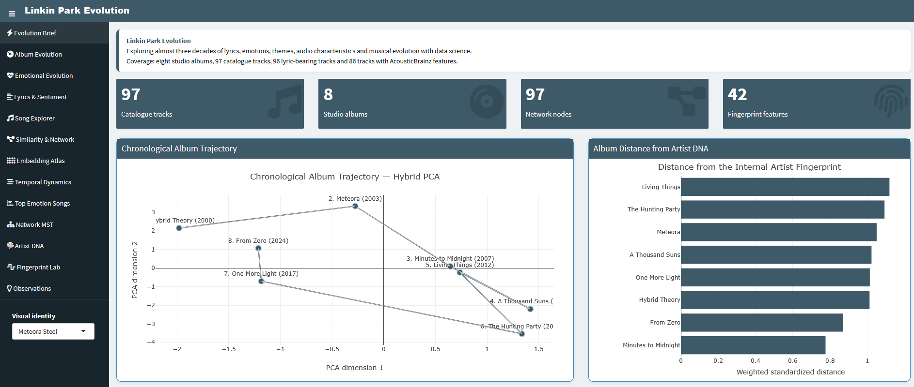
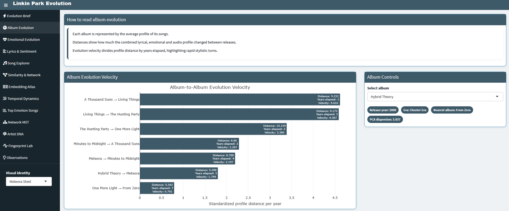
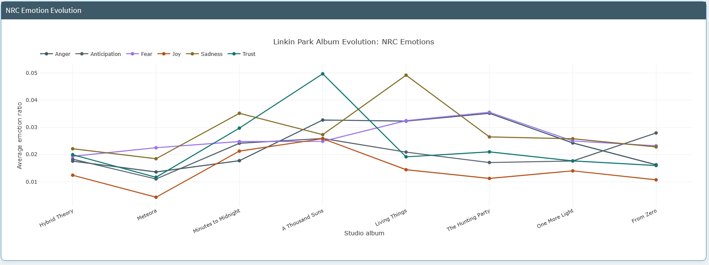
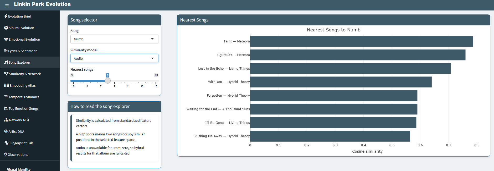
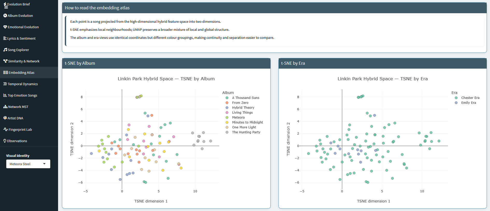
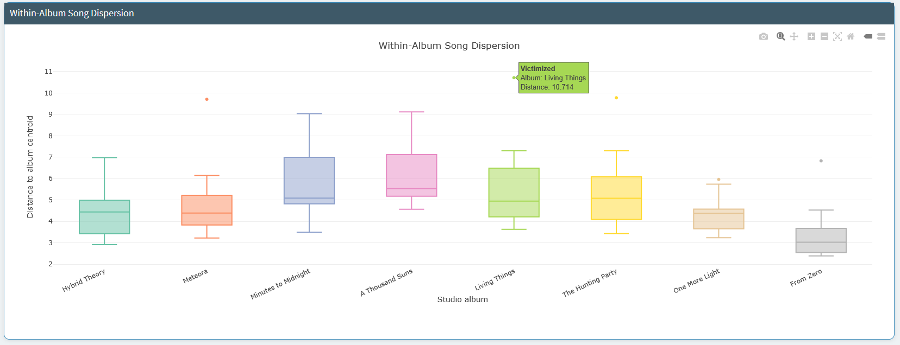
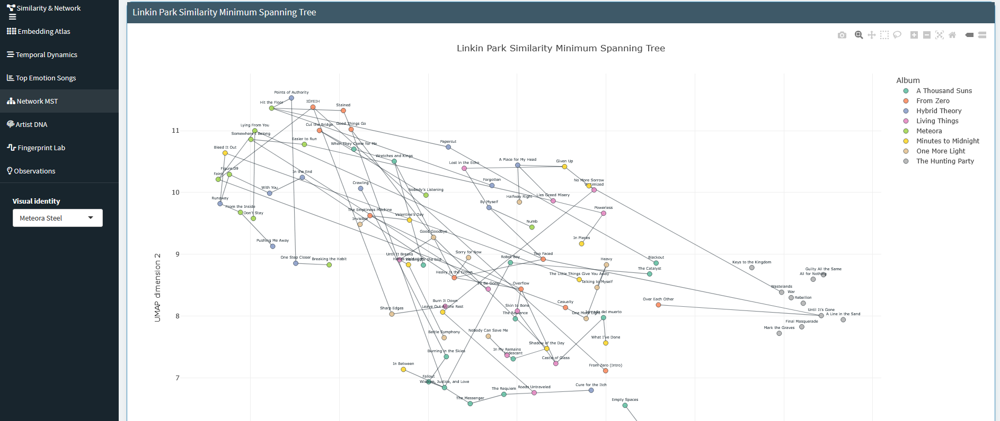
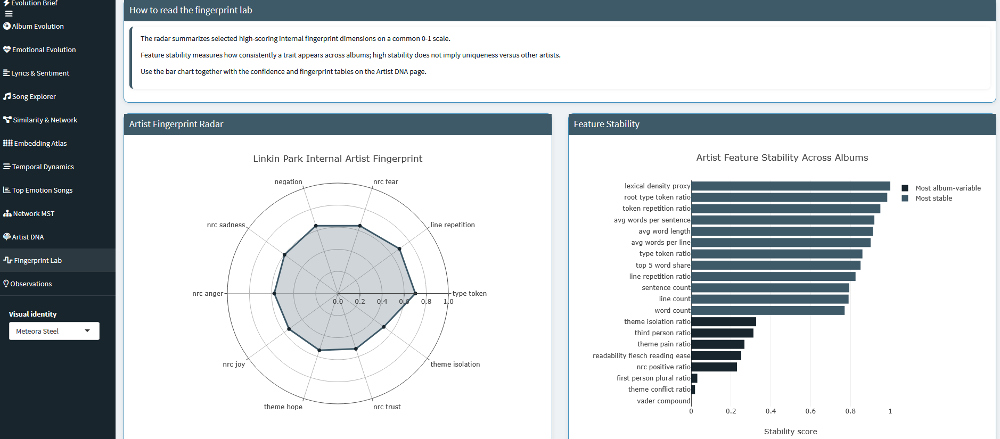

# Linkin Park Evolution

An end-to-end data science project exploring how Linkin Park's music evolved across eight studio albums through lyrics, emotions, audio characteristics, similarity modelling, dimensionality reduction, network analysis, interpretable machine learning and an interactive R Shiny dashboard.

The project covers **97 catalogue tracks**, including **96 lyric-bearing tracks** and **86 tracks with AcousticBrainz features**.

> This is a descriptive catalogue analysis. Results should be interpreted as model-based patterns rather than causal or definitive statements about artistic intent.

---

## Project Highlights

- MusicBrainz-based studio-album and track catalogue
- LRCLIB lyric collection with fuzzy matching and manual-review outputs
- AcousticBrainz audio-feature recovery and availability reporting
- More than 100 lyrical, emotional, structural and audio features per eligible song
- Four song-similarity spaces: emotion, lyrics style, audio and hybrid
- Song recommender for any selected track
- Album clustering and catalogue embeddings with PCA, UMAP and t-SNE
- Album evolution, turning-point, velocity and temporal-drift analysis
- Similarity networks with PageRank, hub, bridge and community metrics
- Minimum spanning tree of the full song catalogue
- Album-prediction models and interpretable album signatures
- Internal artist fingerprint and cross-album feature stability
- Interactive R Shiny dashboard with multiple Linkin Park-inspired visual themes

---

## Main Findings

The current analytical outputs indicate that:

- **From Zero** is closest to **Hybrid Theory** in the two-dimensional hybrid PCA album space.
- **Living Things** and **Minutes to Midnight** form the closest album-centroid pair.
- **The Hunting Party → One More Light** is the largest album-profile shift.
- **A Thousand Suns → Living Things** has the highest estimated evolution velocity.
- **One More Light** is the most internally cohesive album in PCA space.
- **A Thousand Suns** is the most internally diverse album.
- For **Numb**, the closest emotional neighbour is **By Myself**, while the closest audio neighbour is **Faint**.
- Audio and hybrid features classify albums substantially better than lyrics-only features.
- **Heavy Is the Crown** and **Two Faced** are prominent network hubs.
- **Drawbar** is the strongest bridge between similarity communities.
- Lexical density, vocabulary structure and repetition are among the most stable elements of the internal artist fingerprint.
- Emotional content varies more strongly between albums than core lyrical structure.
- The Emily-era profile contains longer lyrics and substantially lower Flesch reading ease.
- Audio comparisons involving **From Zero** remain limited because AcousticBrainz coverage is unavailable.

---

## Dashboard

The R Shiny dashboard provides the following views:

1. **Evolution Brief**  
   Executive overview of album trajectory, album distance, major shifts and model performance.

2. **Album Evolution**  
   Evolution velocity, chronological embedding path and album summaries.

3. **Emotional Evolution**  
   NRC emotion trends and AcousticBrainz mood probabilities.

4. **Lyrics & Sentiment**  
   Lyrics-style features and VADER sentiment evolution.

5. **Song Explorer**  
   Interactive nearest-neighbour recommendations in four feature spaces.

6. **Similarity & Network**  
   Song communities, hubs, bridges and network leaders.

7. **Embedding Atlas**  
   t-SNE and UMAP views grouped by album and vocalist era.

8. **Temporal Dynamics**  
   Chester-era versus Emily-era comparisons and within-album song dispersion.

9. **Top Emotion Songs**  
   Rankings for anger, sadness, positive sentiment and negative sentiment.

10. **Network MST**  
    Minimum spanning tree connecting the full catalogue through essential similarity links.

11. **Artist DNA**  
    Core artist fingerprint, emotional balance and album deviation.

12. **Fingerprint Lab**  
    Fingerprint radar and stable-versus-variable feature analysis.

13. **Observations**  
    Fifteen concise, interpretation-focused findings.

The dashboard includes multiple visual identities inspired by the band's album eras, including **Hybrid Theory Red**, **Meteora Steel**, **A Thousand Suns** and **From Zero Neon**.

---

---

## Dashboard Preview










---

## Data Sources

### MusicBrainz

MusicBrainz provides album, release, recording, track, duration and identifier metadata.

Collection script:

```bash
python src/collection/download_musicbrainz.py
```

### LRCLIB

LRCLIB is used to retrieve lyrics. Candidate records are scored using title, album, artist and duration similarity. Raw lyrics remain local and are excluded from Git.

Collection script:

```bash
python src/collection/download_lyrics.py
```

### AcousticBrainz

Historical AcousticBrainz low-level and high-level audio features are retrieved by MusicBrainz recording ID where available. The service was discontinued, so missing records and API availability are explicitly tracked.

Collection script:

```bash
python src/collection/download_acousticbrainz.py
```

---

## Analytical Pipeline

Run the scripts from the repository root.

### 1. Build the canonical catalogue

```bash
python src/preprocessing/build_master_tracks.py
```

### 2. Collect lyrics and audio metadata

```bash
python src/collection/download_lyrics.py
python src/collection/download_acousticbrainz.py
```

### 3. Clean and engineer features

```bash
python src/preprocessing/clean_lyrics.py
python src/features/build_nlp_features.py
python src/preprocessing/build_acousticbrainz_features.py
python src/preprocessing/build_master_dataset.py
```

### 4. Run the analysis

```bash
python src/analysis/01_dataset_overview.py
python src/analysis/02_song_similarity.py
python src/analysis/03_album_clustering.py
python src/analysis/04_song_recommender.py --song "Numb" --model audio --top-n 8
python src/analysis/05_album_evolution.py
python src/analysis/06_dimensionality_reduction.py
python src/analysis/07_network_graph.py
python src/analysis/08_temporal_dynamics.py
python src/analysis/09_album_embedding_story.py
python src/analysis/10_predict_album.py
python src/analysis/11_interpretable_album_rules.py
python src/analysis/12_artist_fingerprint.py
```

---

## Analysis Modules

| Script | Purpose |
|---|---|
| `01_dataset_overview.py` | Catalogue quality checks, descriptive statistics, album summaries and initial findings |
| `02_song_similarity.py` | Emotion, lyrics-style, audio and hybrid similarity matrices |
| `03_album_clustering.py` | PCA-assisted clustering and cluster interpretation |
| `04_song_recommender.py` | Command-line nearest-song recommender |
| `05_album_evolution.py` | Album profiles, rankings, change points and evolution figures |
| `06_dimensionality_reduction.py` | PCA, UMAP and t-SNE song embeddings |
| `07_network_graph.py` | Song network, PageRank, hubs, bridges, communities, MST and Gephi exports |
| `08_temporal_dynamics.py` | Album transitions, temporal velocity, feature drift and era comparison |
| `09_album_embedding_story.py` | Album-level embedding narrative and turning points |
| `10_predict_album.py` | Cross-validated album prediction using multiple feature spaces and models |
| `11_interpretable_album_rules.py` | Global importance, album signatures, local explanations and counterfactuals |
| `12_artist_fingerprint.py` | Stable catalogue traits, album deviation, emotional balance and bootstrap confidence |

---

## Project Structure

```text
Linkin-Park-Evolution/
├── app.R
├── R/
│   └── plots.R
├── src/
│   ├── collection/
│   │   ├── download_musicbrainz.py
│   │   ├── download_lyrics.py
│   │   └── download_acousticbrainz.py
│   ├── preprocessing/
│   │   ├── build_master_tracks.py
│   │   ├── clean_lyrics.py
│   │   ├── build_acousticbrainz_features.py
│   │   └── build_master_dataset.py
│   ├── features/
│   │   ├── build_nlp_features.py
│   │   └── extract_audio_features.py
│   └── analysis/
│       ├── 00_inspect_musicbrainz.py
│       ├── 01_dataset_overview.py
│       ├── 02_song_similarity.py
│       ├── 03_album_clustering.py
│       ├── 04_song_recommender.py
│       ├── 05_album_evolution.py
│       ├── 06_dimensionality_reduction.py
│       ├── 07_network_graph.py
│       ├── 08_temporal_dynamics.py
│       ├── 09_album_embedding_story.py
│       ├── 10_predict_album.py
│       ├── 11_interpretable_album_rules.py
│       └── 12_artist_fingerprint.py
├── data/
│   ├── raw/
│   ├── interim/
│   └── processed/
├── outputs/
│   ├── figures/
│   ├── tables/
│   └── recommendations/
├── requirements.txt
└── README.md
```

---

## Installation

### Python

```bash
conda create -n linkin-park-evolution python=3.11 -y
conda activate linkin-park-evolution
pip install -r requirements.txt
```

### R

Install the dashboard dependencies:

```r
install.packages(c(
  "shiny",
  "shinydashboard",
  "plotly",
  "DT",
  "dplyr",
  "tidyr",
  "readr",
  "scales",
  "stringr",
  "htmltools",
  "arrow"
))
```

---

## Run the Dashboard

From the project root:

```r
shiny::runApp()
```

Or open `app.R` in RStudio and select **Run App**.

The dashboard reads processed Parquet/CSV tables and analytical outputs from the repository. It also supports running the Shiny application from a sibling folder when the main analytical repository remains beside it.

---

## Outputs

The analytical pipeline produces:

- Processed song-level Parquet and CSV datasets
- Album evolution and temporal-dynamics tables
- Song-similarity matrices
- PCA, UMAP and t-SNE embeddings
- Clustering summaries
- Prediction and interpretability outputs
- Network metrics and community tables
- Gephi-compatible GEXF, GraphML, node and edge files
- Minimum spanning tree outputs
- Artist-fingerprint and feature-stability tables
- Static figures and interactive dashboard views

---

## Data and Copyright Notes

- Raw lyrics are copyrighted and are intentionally excluded from the repository.
- The repository should contain derived numerical features and review metadata rather than complete lyric text.
- AcousticBrainz coverage is incomplete and unavailable for `From Zero`.
- MusicBrainz metadata is collected using a rate-limited, identifiable user agent.
- Analytical findings describe this dataset and pipeline; they are not claims about authorial intent or musical quality.

---

## Reproducibility Notes

- Randomized analyses use fixed seeds where appropriate.
- PCA, clustering, UMAP, t-SNE and model outputs depend on preprocessing and feature availability.
- Similarity scores are meaningful within a selected feature space and should not be compared directly across models.
- Small album-level sample sizes limit the reliability of predictive evaluation.
- Missing audio features are kept visible rather than silently imputed across eras.

---

## Technology

**Python:** pandas, NumPy, scikit-learn, NetworkX, UMAP, Matplotlib, Plotly-compatible outputs, Requests, RapidFuzz, PyArrow  
**R:** Shiny, shinydashboard, Plotly, DT, dplyr, tidyr, readr  
**Data:** MusicBrainz, LRCLIB, historical AcousticBrainz outputs  
**Methods:** NLP feature engineering, sentiment analysis, cosine similarity, PCA, UMAP, t-SNE, clustering, classification, explainability, graph analytics, bootstrap stability

---

## License

Code is released under the repository's license. External metadata and derived features remain subject to their respective source terms. Raw lyrics are not distributed.